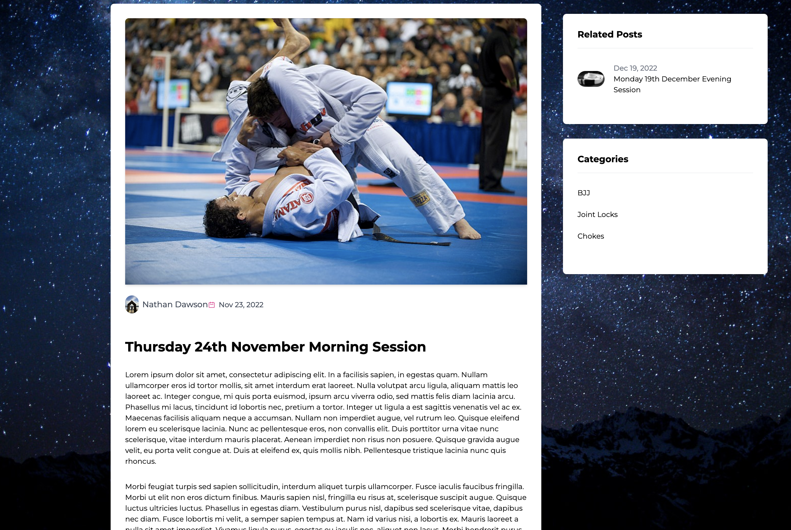

# The BJJ Journey

A simple blog website developed with React, enabling me to write blog posts about my Brazilian Jiu Jitsu (BJJ) training sessions to reflect.

 

The website features the following:
- Blog posts both summarized and detailed upon clicking 'Continue Reading'
- A 'Recent Posts' section showcasing the top 3 most recent posts
- A 'Categories' section allowing for the filtering of posts
- Displays author information at the bottom of their posts
- A comment section, allowing users to 'Leave a Comment'
- User submitted comments are first sent as 'Drafts' and after admin review inside the database, admins have the ability to either publish the comments to the website (allowing the comments to be shown) or not with admin discretion

 

### Website Showcase
---
 

 

  